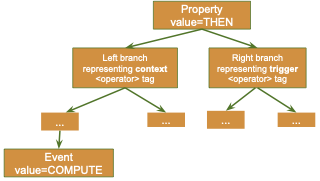

# Semantics of XML rule description

The 5Greplay rules are intended for formally specifying events on the network that denotes packets to be forwarded, dropped or modified. They rely on LTL (Linear Temporal Logic) and are written in XML format. This has the advantage of being a simple and straight forward structure for the verification and processing performed by the tool. In the context of this document, we use the terms of properties and rules interchangeably.

When defining a rule, users must indicate in the rule:
- which packet will be process (filtering)
- which action will be used (dropping, forwarding, or modifying)
- how to modify the packet (definition of the value to be changed in case of the action to be taken is a modification)


## Description

A 5Greplay rule is a XML file that can contain as many events as required to filter the desired packets to apply the actions defined by the properties (i.e forwarding or dropping it, with or without modification)
The file needs to begin with a `<beginning>` tag and end with `</beginning>`. 
Each property begins with a `<property>` tag and ends with `</property>`. 
A property is a *"general ordered tree"*, that can be graphically represented as shown in Figure




## Property validation

The nodes of the property tree are: the property node (required), op- erator nodes (optional) and event nodes (required). The property node is forcibly the root node and the event nodes are forcibly leaf nodes. In general, the left branch represents the context and the right branch rep- resents the trigger. This means that the property is found valid when the trigger is found valid; and the trigger is checked only if the context is valid.

The following example rule selects only the packets that come from 192.168.0.15. These packets will not be forwarded to the output NIC.

Thus, if 5Greplay is configured with the default action in the config file is forward, then it forwards the traffic that does not come from 192.168.0.15.

```xml
<property property_id="100" type_property="FORWARD" description="Drop any IP traffic that comes from 192.168.0.15" if_satisfied="#drop()">
   <event description="Not interested traffic" boolean_expression="(ip.src == '192.168.0.15')"/>
</property>
```

## Property attributes

The `<property>` tag contains several attributes, some required, some optional:


- `property_id`:  accepted value: Integer; required;

   Property id number, should go from 1 to n where n is the total number of
properties in the XML file. In one or different XML files, two different properties must have two different `property_id`

- `value`: accepted value: `THEN`, `BEFORE`; required;

   A property is a tree and each node can have one or more branches. The
`<property>` tag here represents the root of a
tree that can have 2 branches: the context and the trigger.

   The value attribute indicates that the left
branch representing the context needs to be valid before, after or at the same time we check the
right branch representing the trigger, depending on the delays defined for the node.

- `type_property`: accepted value: `FORWARD`, `TEST`; optional; default value: `FORWARD`;

   Indicates that the property specifies a potential attack/evasion (or abnormal
behaviour) or that the property specifies a security rule that needs to
be respected.

- `delay_min`, `delay_max`: accepted value: Integer; optional; default value: 0;

   Defines the validity period ([delay_min, delay_max]) of the left branch
(e.g. context). 

   If we have [a,b] with `a=b=0` then the left branch needs to occur in the
same time as the right branch. 

   If we have `a<b<=0` then the right branch needs to
have occurred in the past time interval with respect to the left
branch. 

   If we have `0<=a<b` then the right branch needs to
occur in the future with respect to the left branch. 

   If the time runs out before detecting the events concerned then we are
in a TIMEOUT condition, i.e., the context occurs but the trigger never arrived in the specified time interval. This would mean that the property failed.  
Note that in the case that an event should not occur during a certain time interval, we refer to it as TIMEIN instead of TIMEOUT.
The default unit of time used is the second but this can be changed using the attribute `delay_units`.

   For `delay_min`, a `+` sign before the value (e.g., `+0`) means strictly greater than the value and for `delay_max` a `-` sign means less than.

- `delay_units`: accepted value: `mms` (microsecond), `ms` (milisecond), `s` (second), `m` (minute), `h` (hour), `D` (day), `M` (month), `Y` (year); optional; defaul value: `s`

   Defines the time units used in `delay_min` and `delay_max` attributes. 
If default value is not wished then this has to be defined before these two attributes.

- `counter_max`, `counter_min`: (under development); accepted value: Integer; optional; default value: 0;

   Similar to `[delay_min, delay_max]` we can define `[counter_min, counter_max]` where the unit is the number of packets analysed. 

   If the count runs out before detecting the events concerned, then we are in, respectively, a COUNTIN or COUNTOUT condition.

- `description`: accepted value: String; required;

   The text that clearly explains what the property is about.\

- `if_satisfied`: accepted value: String; optional;
   
   Defines what action should be performed if the property is satisfied. 
The string gives the name of the function that should be executed.


## Operator attributes

The `<operator>` tag in a property contains several attributes, some required, some optional:

- `value`: accepted value: `THEN`, `OR`, `AND`, `NOT`; required;

   Operators are used to combine different events and build complex events.

   + `THEN` operator is used to describe ordered events, 
   + `AND` operator is used to describe two events without any order and
   + `OR` operator is used to describe the occurrence of a least one of the events. 
   + `NOT` negates the underlying sub-tree.

- `description`: accepted value: String; optional;

   Gives the text that clearly explains what the complex event is about.

- `delay_min`, `delay_max`, `counter_min`, `counter_max`: accepted value: Integer; optional; defaul value: 0;

   Same as for the `<property>` tag. Note that these attributes are not to be used for the OR and NOT operators.


## Event attributes

Properties indicate the sequence of events that need to be observed. 
Events indicate the conditions that need to be verified on a packet or a set of packets for the event to hold. The `<event>` tag in a property
contains several attributes, some required, some optional:


- `event_id`: accepted value: Integer; required;

   This field allows identifying each event and starts from 1 to n where n is the total number of events in the current property.

- `description`: accepted value: String; required; 

   Gives the text that clearly explains what the event is about.

- `value`: accepted value: `COMPUTE`; required;

  Means that the events need to resolve a Boolean expression that is equal to `true` or `false` depending on the attributes values

- `boolean_expression`: accepted value: expression; required;

A Boolean expression, similar to a Boolean expression in the C language (explained in the following paragraph).


## Boolean expressions:

The `boolean_expression` is a logical combination of `<protocol name>`.`<field name>` and `<number>` with the following operators:

- logical operators: `&&`, `||`, `>`, `>=`, `<`, `<=`, `==`, `!=`

- arithmetic operators: `+`, `-`, `*`, `/`

Blanks and tabs are ignored.

Note that the `&&` operator needs to be written in XML as
`&amp;&amp;`, 
`<` needs to be written as `&lt;`, etc.


A simple `boolean_expression` can be of the form: 

```
(<expression> <operator> <expression>)
```

in which, `<expression>` is one of the followings:


- `<protocol_name>.<attribute_name>`
- `<protocol_name>.<attribute_name>.<event_id>`
- `<numeric_value>`
- `<string_value>`
- `true`
- `false`
- embedded function


The Boolean expressions must respect some syntax rules:

- The building bloc needs to start with a
`(` and end with a `)`. 

   Note that to avoid any ambiguities the quotes should explicitly define how the expression is to be resolved, 
e.g, `A && B || C` should be written as `((A && B) || C)` or `(A && (B || C))`.

- An attribute needs to be identified with its `protocol_name` and its `attribute_name` separated by a dot
`.`.

- If the attribute refers to an attribute value from another event,
then the name needs to be followed by a second `.` and the `event_id` number of
the event concerned. For instance we can have:


  + `(arp.ar_op == 0)` means that the field `arp.ar_op` should be equal to zero.
  + `(arp.ar_op == arp.ar_op.1)` means that the field `arp.ar_op` should be equal to the field `arp.ar_op` of the event in the same rule with the `event_id` equal to 1.


### Example of a Boolean expression:

For example; the following expression means that the event is valid if the packet received corresponds to the ARP protocol;
the `ar_op` is 2; `ar_sip` is the same as `ar_tip` of an event 1; 
and, `ar_sha` is different with `ar_sha` of event 2. 
Where events 1 and 2 occurred before or will occur after depending on the order that the events should occur (defined by the time intervals specified).

```xml
"(((arp.ar_op == 2)&amp;&amp;(arp.ar_sip == arp.ar_tip.1)) &amp;&amp;(arp.ar_sha != arp.ar_sha.2))"
```

The following table gives a more detailed explanation about the
information that is used in the Boolean expression:


- `protocol_name` is a string. It indicates the protocol of the packet that we need to inspect.
- `attribute_name` is a string. It indicates the field of the protocol that we will use for verifying a condition in the event.
- `numeric_value` is an integer. It gives the value that will be used to compare with the packet field value. 

   Note that the `protocol_name` and the `attribute_name` allow uniquely identifying the type of value a field contains 
 (e.g. number, IP address, MAC address in binary format).

   Two specific constants, `true` and `false`, represent respectively a non-zero and zero number.

- `string_value` is a string. It gives a chain of characters, enclosed by ' and ', ex: `'GET'`

- `reference` is an integer. It indicates that we are to use the data obtained for the field from an
event that occurred before (a previously received packet that validated the previous event). 
The name is a number that clearly identifies the event and needs to be exactly the same as the value given in the
`event_id` attribute of the corresponding `<event>` tag. 

   Note that one should refer to events that occurred beforehand in the property.


Embedded functions can be used to extend the elements used in the Boolean expressions.


# Links

- [Rule](../rule)
- [Replay Example](../../tutorial/replay-open5gs)
